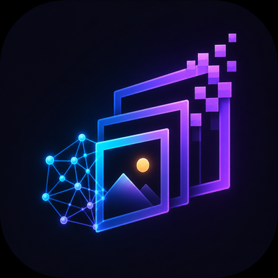
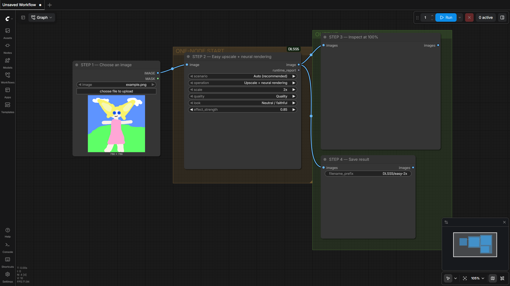
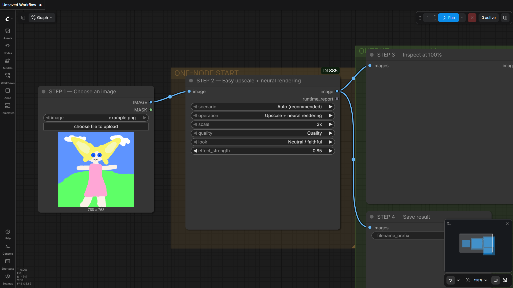
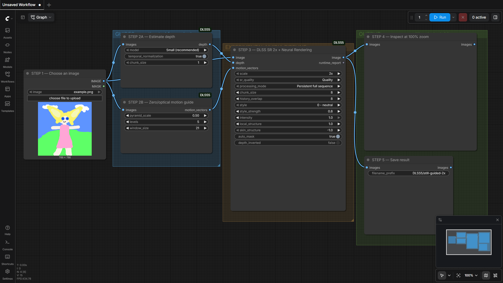
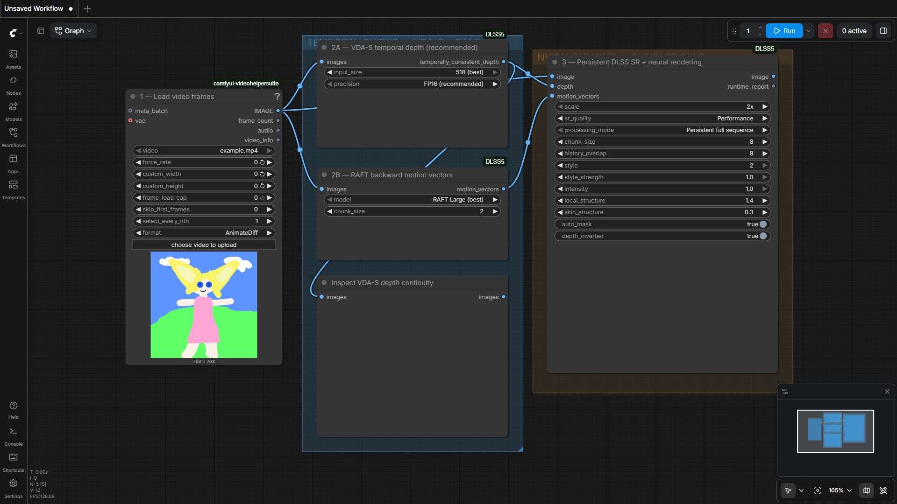
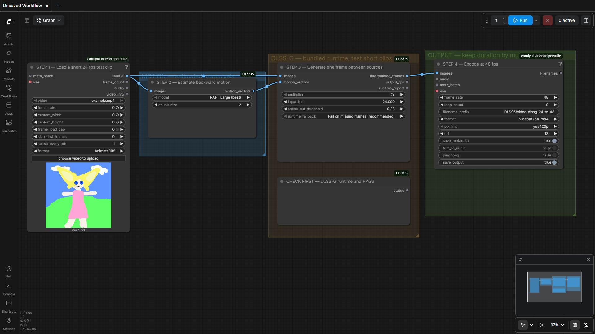

# Experimental DLSS Neural Rendering for ComfyUI

<p align="center">
  
</p>

An unofficial Windows-only ComfyUI extension for NVIDIA DLSS Super Resolution,
experimental DLSS Neural Rendering, and optional DLSS Frame Generation. It
connects ComfyUI image or video batches to VapourSynth and D3D12 bridge
wrappers.

> [!WARNING]
> This is an experimental alpha project. It is not affiliated with NVIDIA,
> ComfyUI, RenoDX, or VapourKit. The repository contains native runtime DLLs;
> review [runtime sources and licenses](docs/RUNTIME_SOURCES.md) before using
> or redistributing them.

## First run: install, check, make an image

Use a working Windows ComfyUI installation with an NVIDIA RTX GPU.

1. **Install the extension.** Use ComfyUI Manager and search for
   **Experimental DLSS Neural Rendering**. If Manager has not refreshed the
   Registry yet, install from
   `https://github.com/HECer/ComfyUI-DLSS5`. A manual clone needs Git LFS:
   `git lfs install` followed by `git lfs pull`. Manager installs this custom
   node package and its declared dependencies.
2. **Restart ComfyUI** so it loads the declared Python dependencies.
3. **Install the base runtime.** Add **DLSS Runtime Setup (One Click)**,
   queue `Check location`, then queue **Install verified VapourKit** with
   `confirm_download` enabled. This installs the pinned isolated VapourKit
   runtime, NumPy, the bundled wrappers, and the SR/NR DLLs. Existing working
   configuration is preserved.
4. **Check the runtime.** Run **DLSS 5 Runtime Status**. `PRESENT` means a
   file exists; Python, VapourSynth/NumPy imports, and plugin probes should be
   `PASS`. `Inference: UNTESTED` is expected until an image is processed.
5. **Run the Easy workflow.** Import
   [workflows/00_easy_one_node_2x.json](workflows/00_easy_one_node_2x.json),
   choose an image in **Load Image**, and keep `Auto (recommended)`,
   `Upscale + neural rendering`, `2x`, `Quality`, and
   `Neutral / faithful` for the first run. Queue the workflow, inspect the
   preview at 100%, and use **Save Image** for the result.

The first guide-model run downloads Depth Anything V2 Small on first use. A still uses zero
motion; video presets use optical flow or RAFT. Easy always uses DA-V2, while
the temporally consistent VDA model is the separate workflow 04. Use the
[troubleshooting guide](docs/TROUBLESHOOTING.md) when a status probe reports
`FAIL`, `MISSING`, or `LFS POINTER`.

The optional Frame Generation feature has a separate setup action. Select
`Install verified Frame Generation` only for workflow 06, then run **DLSS
Frame Generation Runtime Status** before processing a clip.

## What this extension does

- DLSS Super Resolution at 2x, 3x, or 4x.
- Experimental Neural Rendering at the current resolution, or after SR in the
  Full Pipeline node.
- Easy one-node presets for stills, short video, long video, and fast previews.
- Depth Anything V2, Video Depth Anything Small, RAFT motion, and temporal
  depth stabilization guides.
- Persistent full-sequence processing and bounded overlap-add processing.
- Optional FlashDepth in its own Python environment for high-resolution video.
- Optional DLSS Frame Generation through the open-source
  [DLSSG-Stream-Worker](https://github.com/HECer/DLSSG-Stream-Worker).

Depth and motion are estimated from pixels. A game integration can provide
geometry, material buffers, exposure, jitter, and engine-authored motion that
this extension cannot recover from an ordinary image or video.

## Choose a workflow

| Workflow | Use it for | Main dependency or note |
| --- | --- | --- |
| [00 — Easy one-node 2x](workflows/00_easy_one_node_2x.json) | First still or simple clip | One node selects the preset and operation |
| [01 — Guided still 2x](workflows/01_still_image_guided_2x.json) | Explicit depth, motion, and Full Pipeline controls | No VideoHelperSuite required |
| [02 — Persistent video 2x](workflows/02_video_persistent_2x.json) | Short or medium clips that fit in memory | VideoHelperSuite loader and encoder |
| [03 — Bounded video 2x](workflows/03_video_bounded_overlap_add_2x.json) | Lower native working-set video processing | Full ComfyUI batches still use RAM |
| [04 — VDA-S temporal 2x](workflows/04_video_vda_small_temporal_2x.json) | Recommended temporally consistent depth | Add an encoder for export |
| [05 — FlashDepth 2x](workflows/05_video_flashdepth_highres_2x.json) | Optional high-resolution depth | Isolated environment; see [setup](docs/FLASHDEPTH.md) |
| [06 — DLSS-G 24→48](workflows/06_video_dlssg_24_to_48.json) | Optional frame generation | Separate worker; match source and output FPS |

All supplied video workflows use
[ComfyUI-VideoHelperSuite](https://github.com/Kosinkadink/ComfyUI-VideoHelperSuite)
for loading. Workflows 02, 03, and 06 include an encoder; workflows 04 and 05
end at Preview Image.

See [workflows/README.md](workflows/README.md) for defaults, dependency notes,
and import guidance.

## Visual examples

These examples show the intended comparison layout and representative output.
They are single-run examples, not a universal quality guarantee. Pixel
differences measure changed pixels, not whether the change is better.


## ComfyUI screenshots

These captures come from the current ComfyUI 0.32.0 production frontend with
the current node package loaded. They show layout and controls, not rendered
quality results.











The complete production capture set, including FlashDepth and other detail
views, is in [docs/images/](docs/images/). Asset history is recorded in
[docs/ASSET_PROVENANCE.md](docs/ASSET_PROVENANCE.md).

## Requirements and runtime files

- Windows 10 or 11, 64-bit, with a recent NVIDIA driver and supported RTX GPU.
- A working ComfyUI installation with PyTorch/CUDA.
- At least 16 GB system RAM; 32 GB or more is recommended for video.
- Fast temporary storage with room for native bridge arrays and video batches.
- The pinned VapourKit runtime, installed by the setup node.

The package contains `vsdlssnr.dll`, `vsdlsssr.dll`, `nvngx_dlss.dll`,
`nvngx_dlssnr.dll`, and the optional `runtime/dlssg/nvngx_dlssg.dll`. Setup
verifies the bundled hashes and keeps downloaded VapourKit, worker files, and
`runtime/config.json` machine-local. Read [runtime/README.md](runtime/README.md)
for exact hashes, manual setup, and the separate Frame Generation install.

The [runtime sources document](docs/RUNTIME_SOURCES.md) lists upstream source
links, licenses, model downloads, wrapper provenance, and components that are
deliberately not dependencies. Do not download a DLL merely because its
filename matches.

## Processing modes and limits

`Persistent full sequence` keeps one native context for the complete batch and
avoids native chunk resets. Use it when the full ComfyUI input and output fit in
RAM. The complete ComfyUI IMAGE input and output still reside in memory.
`Bounded overlap-add` limits native windows to
`chunk_size + history_overlap` frames and blends their overlap; it still keeps
the complete ComfyUI IMAGE batch in memory.

Easy's long-video and fast-preview presets apply bounded windows to all selected
operations. The runtime report includes the resolved scenario, active settings,
dimensions, frame counts, and an advisory temporary-storage estimate. The
estimate excludes model weights, extra copies, and file overhead.

### Progress, cancellation and storage advice

ComfyUI progress covers guide work, native windows, and native frames. Model
downloads and VDA/FlashDepth calls may have long gaps between updates. Cancel
with ComfyUI's interrupt control; SR/NR child processes are stopped before
temporary files are cleaned up. Optional VDA and FlashDepth cancellation is
checked at stage boundaries, so an active model call may finish first.

Use a shorter clip, lower resolution, more temporary disk space, or bounded mode
when a persistent run exceeds memory. See
[Troubleshooting](docs/TROUBLESHOOTING.md) for ghosting, depth trails, runtime
diagnostics, and stuck-process guidance.

## Node overview

| Node | Purpose |
| --- | --- |
| **DLSS Super Resolution** | 2x–4x native SR with color, depth, and motion guides |
| **Experimental Neural Rendering** | 1:1 neural pass with style and structure controls |
| **DLSS SR + Neural Rendering** | SR followed by NR with persistent or bounded routing |
| **Easy Upscale & Render** | Preset-based image and video entry point |
| **Depth Anything V2 Guide** | Pixel-estimated depth with optional temporal normalization |
| **Video Depth Anything** | Temporally consistent depth for video windows |
| **RAFT Motion Guide** | Current-to-previous dense motion for reprojection |
| **Temporal Depth Stabilizer** | Reprojects and blends depth across frames |
| **FlashDepth** | Optional external high-resolution depth backend |
| **DLSS Frame Generation** | Inserts generated frames through the separate worker |
| **Runtime Status nodes** | File, interpreter, plugin, worker, and HAGS diagnostics |

For control names and serialized defaults, inspect the example workflows and
the [workflow notes](workflows/README.md). Runtime status is a diagnostic, not
a certification of GPU inference or image quality.

## Models, privacy, and security

Depth Anything V2, VDA-S, and RAFT weights download on first use from their
respective [model sources](docs/RUNTIME_SOURCES.md). Review each model card and
license before redistribution.

ComfyUI video outputs can embed workflows, prompts, filenames, model names, and
paths as media metadata. Inspect metadata before sharing output and keep source
attributions and AI disclosures with public examples. Never publish
`runtime/config.json`.

Workflows and native DLLs execute with ComfyUI's permissions. Review imported
workflows, verify hashes and provenance where possible, and report security
issues through GitHub's private security advisory feature.

## Tests and troubleshooting

Run the full suite with:

```powershell
python -m pytest -q -p no:cacheprovider tests
```

The tests validate setup/configuration preservation, node schemas, all seven
workflow graphs, routing, progress, cancellation, and synthetic bridge
journeys. They do not certify model quality or every GPU/driver combination.

Start with [Troubleshooting](docs/TROUBLESHOOTING.md). For a bug report, attach
a redacted Runtime Status report, console traceback, workflow JSON, expected and
actual frame count/resolution/FPS, and runtime hashes. Do not attach
proprietary DLLs or private media.

## License and credits

Extension source code is GPL-3.0. NVIDIA components, VapourKit, VapourSynth,
ComfyUI, model weights, worker binaries, and example media retain their own
licenses; see [runtime sources](docs/RUNTIME_SOURCES.md).

The project credits ComfyUI, VapourSynth, VapourKit, NVIDIA DLSS runtime
components, TorchVision RAFT, Depth Anything, Video Depth Anything, FlashDepth,
ComfyUI-VideoHelperSuite, and the DLSSG-Stream-Worker project.

“DLSS5” is the historical project name for this experimental runtime and does
not imply an official NVIDIA DLSS 5 SDK integration. DLSS and NVIDIA are
trademarks of NVIDIA Corporation.
