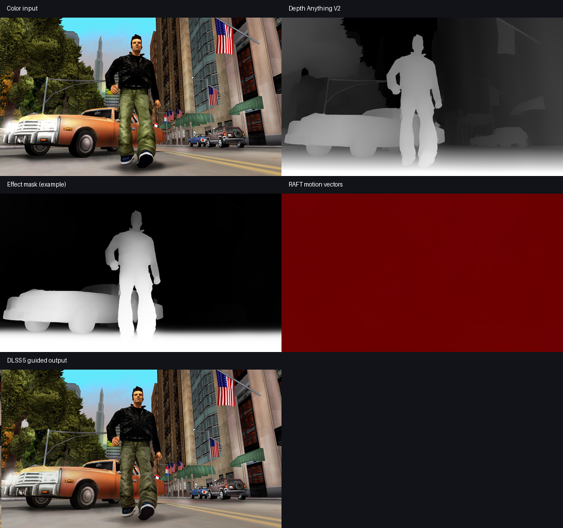
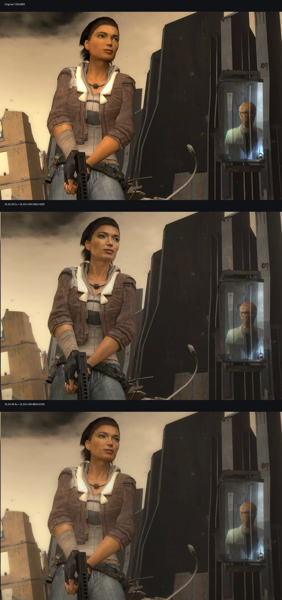
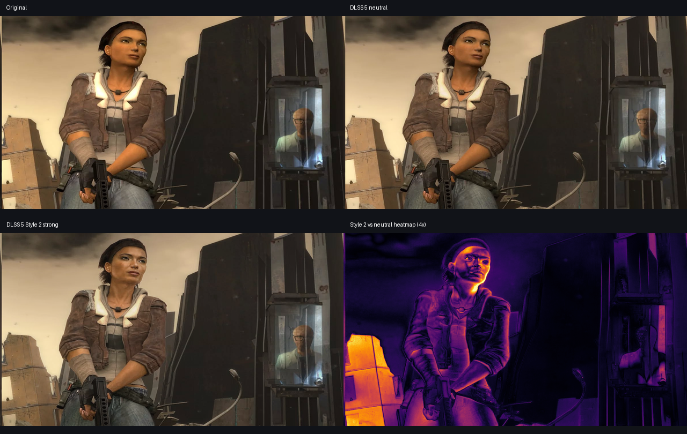
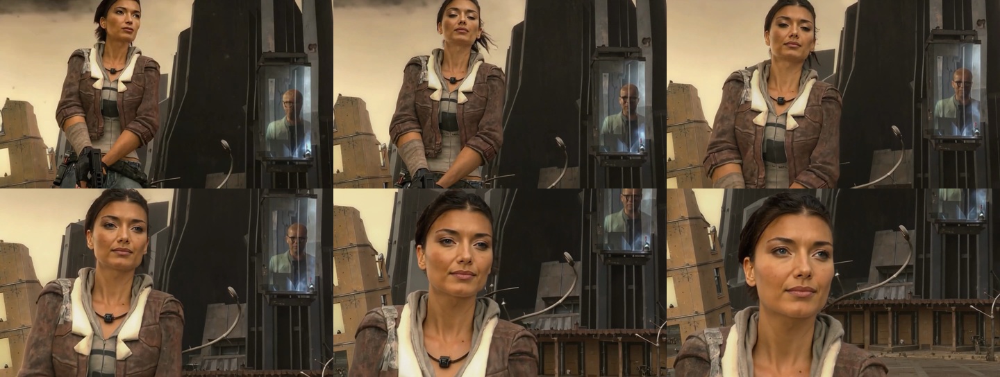

# Experimental DLSS Neural Rendering for ComfyUI

An unofficial Windows-only ComfyUI extension that connects image and video batches to NVIDIA DLSS Super Resolution and an experimental DLSS Neural Rendering runtime through VapourSynth/D3D12 wrappers.

> [!IMPORTANT]
> This project is not affiliated with, endorsed by, or supported by NVIDIA, ComfyUI, RenoDX, or VapourKit. It does **not** distribute NVIDIA runtime DLLs or patched game files. You must obtain every runtime file legally and review its license and trust implications yourself.



## What this extension does

- Runs NVIDIA DLSS Super Resolution at 2x, 3x, or 4x.
- Runs the experimental neural rendering pass exposed by a user-supplied `nvngx_dlssnr.dll`.
- Accepts depth and dense motion-vector guides.
- Includes Depth Anything V2 and RAFT guide nodes.
- Stabilizes per-frame depth by reprojecting previous depth with backward motion.
- Supports one persistent native context for short and medium sequences.
- Provides bounded overlap-add processing as a lower-memory fallback.
- Uses memory-mapped files for large native bridge inputs and outputs.

It does not turn an arbitrary photograph into a physically correct game-engine render. Game integrations have native geometry, material buffers, exposure data, jitter, accurate motion vectors, and engine-specific training assumptions. Here, depth and motion are estimated from pixels, so results can differ substantially.

## Current status

This is an **experimental alpha release**. It was locally validated on Windows with an RTX 5090, 24 fps input, 2x scaling, Depth Anything V2 Small, RAFT Large, and a user-supplied neural-rendering runtime.

Known limitations:

- Windows and NVIDIA D3D12 only.
- Runtime compatibility depends on the exact NVIDIA DLL, driver, GPU, and wrapper build.
- `Persistent full sequence` removes native chunk resets but ComfyUI still owns the full IMAGE batch.
- Long films should use `Bounded overlap-add` until a file-to-file streaming node is released.
- HDR, alpha, variable-frame-rate video, subtitles, scene-cut resets, and multi-hour processing need broader testing.
- Depth Anything and RAFT download model weights on first use.

## Visual examples

### 2x and 4x output

The comparison canvas preserves aspect ratio; images are fitted, never stretched.



### Neural-rendering styles



### Persistent 10-second video test

Six un-stretched frames sampled from a 241-frame, 1920x1088, 24 fps output produced with one persistent SR context and one persistent NR context.



Measured on that test:

| Metric | Result |
|---|---:|
| Frames | 241 |
| Duration | 10.0417 s |
| Output | 1920x1088 at 24 fps |
| Mean temporal MAE ratio vs. source | 1.005 |
| Former 8-frame boundary excess | 0.000062 |
| Non-boundary excess | 0.000064 |
| Boundary/non-boundary ratio | 0.966 |

The fixed 8-frame discontinuity was not measurable above ordinary frames in this sample. This is a result for one test clip, not a universal quality guarantee.

## Requirements

- Windows 10 or 11, 64-bit.
- NVIDIA RTX GPU with a sufficiently recent driver for the selected runtime.
- A working ComfyUI installation with PyTorch/CUDA.
- At least 16 GB system RAM; 32 GB or more is recommended for video.
- Generous temporary storage. Persistent 2x video processing can temporarily require many gigabytes.
- An extracted VapourKit build containing:
  - `python.exe` with VapourSynth support
  - `vsdlsssr.dll`
  - `vsdlssnr.dll`
  - `nvngx_dlss.dll`
- A legally obtained, user-supplied `nvngx_dlssnr.dll` compatible with the wrapper.

See [Runtime sources and legal notes](docs/RUNTIME_SOURCES.md) before installation.

## Where to get every required component

| Component | Files used by this extension | Source | Setup handling |
| --- | --- | --- | --- |
| ComfyUI | ComfyUI installation | [Official ComfyUI repository](https://github.com/comfyanonymous/ComfyUI) | Pass its directory to `-ComfyUIPath`. |
| This extension | Python nodes, workflows, setup script | [ComfyUI-DLSS5 releases](https://github.com/HECer/ComfyUI-DLSS5/releases) | Clone or extract it; do not copy runtime DLLs into Git. |
| VapourKit Windows runtime | VapourSynth `python.exe`, `vsdlsssr.dll`, `vsdlssnr.dll`, `nvngx_dlss.dll` | [VapourKit project](https://github.com/Kim2091/vapourkit), [tested 2026-08-31 nightly](https://github.com/Kim2091/vapourkit-nightly/releases/tag/nightly-2026-08-31), and [official community Discord](https://discord.gg/uYKMn2hGwB) | Extract it and pass the root directory to `-VapourKitPath`; setup locates the files recursively. Discord is a support/community link, not proof that a particular uploaded proprietary DLL may be redistributed. |
| NVIDIA DLSS reference/runtime licensing | DLSS documentation and official SR SDK/runtime source | [Official NVIDIA/DLSS repository](https://github.com/NVIDIA/DLSS) and [NVIDIA DLSS developer page](https://developer.nvidia.com/rtx/dlss) | Read the included licenses. The tested VapourKit package already supplies the SR runtime expected by setup. |
| Experimental neural-rendering runtime | `nvngx_dlssnr.dll` | No generally available official NVIDIA download was identified for this experimental file at release time. Use only a copy from software you legally obtained and whose terms permit this use. | Pass the exact local file to `-NeuralRuntimeDll`. The file is copied only into the ignored local `runtime` directory. |
| Depth guide | Depth Anything V2 Small/Base/Large weights | [Depth Anything V2 Small model card](https://huggingface.co/depth-anything/Depth-Anything-V2-Small-hf) and [Depth Anything organization](https://huggingface.co/depth-anything) | Downloaded automatically by Transformers on first use. |
| Motion guide | TorchVision RAFT Small/Large weights | [TorchVision RAFT documentation](https://pytorch.org/vision/stable/models/raft.html) | Downloaded automatically by TorchVision on first use. |
| Video loading/encoding | Video Helper Suite custom nodes | [ComfyUI-VideoHelperSuite](https://github.com/Kosinkadink/ComfyUI-VideoHelperSuite) | Optional for the supplied video workflows; install through ComfyUI Manager or from its repository. |
| GPU driver | Current NVIDIA Windows driver | [Official NVIDIA driver download](https://www.nvidia.com/Download/index.aspx) | Install outside ComfyUI and restart Windows if requested. |

ReShade, game-specific injectors, DLSS override utilities, and Nexus mods are not dependencies of this extension. Do not download a DLL merely because its filename matches: provenance, version compatibility, licensing, and integrity still matter.

## One-time setup

### Recommended: ComfyUI Manager + one-click runtime setup

1. Install **ComfyUI-DLSS5** with ComfyUI Manager. Until the Registry listing is approved, use Manager's Git URL installation with `https://github.com/HECer/ComfyUI-DLSS5`.
2. Restart ComfyUI once so Manager installs the dependencies declared in `pyproject.toml`/`requirements.txt`.
3. Add **DLSS Runtime Setup (One Click)** to a workflow, leave `action` at `Check location`, and queue it. The output shows the exact local `runtime` directory and creates it if necessary.
4. Copy your legally obtained `nvngx_dlssnr.dll` to that displayed location. Keep the exact filename.
5. In the same node, select `Install verified VapourKit`, enable `confirm_download`, and queue it again.

The installer downloads the pinned [VapourKit Windows nightly](https://github.com/Kim2091/vapourkit-nightly/releases/tag/nightly-2026-08-31), verifies its published SHA-256 (`af3ecfb868a96477ab10e1588d7bac0fb2729332f2f464b998677efdee9e0554`), extracts it into the ignored local runtime directory, locates all wrappers/runtimes, and writes `runtime/config.json`. Restart ComfyUI and run **DLSS 5 Runtime Status**.

The 368 MB VapourKit archive is downloaded only once. Extracted files and configuration remain local and are excluded from Git and Registry packages. The installer never downloads `nvngx_dlssnr.dll`.

No terminal or PowerShell command is required for the recommended path. `install_runtime.ps1` and `install_runtime.py` remain available as headless/manual alternatives.

### Manual/existing VapourKit setup

### 1. Clone the extension

```powershell
git clone https://github.com/HECer/ComfyUI-DLSS5.git
cd ComfyUI-DLSS5
```

The repository may live anywhere. The setup script creates a junction in ComfyUI's `custom_nodes` directory.

### 2. Obtain and extract VapourKit

Download a compatible Windows build from the official VapourKit project or its nightly releases. The release used during development was the 2026-08-31 nightly:

- <https://github.com/Kim2091/vapourkit>
- <https://github.com/Kim2091/vapourkit-nightly/releases>
- <https://github.com/Kim2091/vapourkit-nightly/releases/tag/nightly-2026-08-31>

Keep the extracted directory. The extension records the path to its isolated VapourSynth Python runtime.

### 3. Obtain the neural-rendering runtime

Provide your own `nvngx_dlssnr.dll`. This repository intentionally does not link to unauthorized mirrors, bypass tools, leaked packages, or copyrighted game archives. If your copy came with software you are licensed to use, verify that its terms permit your intended use.

### 4. Run setup once

```powershell
.\setup.ps1 `
  -ComfyUIPath "O:\AI\ComfyUI" `
  -VapourKitPath "O:\Tools\VapourKit" `
  -NeuralRuntimeDll "O:\Runtimes\nvngx_dlssnr.dll" `
  -TempDirectory "O:\ComfyTemp\DLSS"
```

The script validates required files, copies the selected local runtime DLLs into the ignored `runtime` directory, writes an ignored machine-local `runtime/config.json`, and creates a junction under `custom_nodes` when needed. ComfyUI Manager/Registry installs the declared Python dependencies; manual Git installations must install `requirements.txt` once with ComfyUI's Python interpreter.

It does not download or install a neural-rendering DLL. The bridge requests VapourKit's caller-check compatibility option; this repository does not patch the proprietary runtime. Review the licenses and terms for every locally supplied component before enabling it.

Restart ComfyUI after setup. Add **DLSS 5 Runtime Status** and confirm that every path reports `READY`.

## Easiest path: one node

Add **Experimental DLSS — Easy Upscale & Render**, connect an `IMAGE` batch, and choose a scenario:

- `Still image` uses lightweight zero/optical motion and one native context.
- `Short video / best quality` uses RAFT Large and a persistent context.
- `Long video / memory efficient` uses RAFT Small and bounded overlap-add.
- `Fast preview` uses CPU optical flow and small bounded windows.

`Auto (recommended)` selects still mode for one frame, the quality-video preset for up to 96 frames, and the memory-efficient long-video preset above that threshold.

Choose `Upscale only`, `Neural rendering only`, or `Upscale + neural rendering`. The node automatically estimates and temporally stabilizes depth and creates current-to-previous motion guides, then runs only the selected stages. `Neutral / faithful` is the safest evaluation look. The Easy node favors practical defaults; use the standalone or Advanced nodes when you have engine-authored depth/motion or need exact controls.

## Quick start: still image

Import [`workflows/01_still_image_guided_2x.json`](workflows/01_still_image_guided_2x.json).

1. Select an input image.
2. Depth Anything V2 estimates a depth guide.
3. Motion is zero for a single still; temporal benefits require a sequence.
4. The full pipeline performs 2x scaling and neural rendering.
5. Preview or save the result.

For a single still, the neural runtime uses a duplicated initialization frame internally.

## Quick start: video

Import [`workflows/02_video_persistent_2x.json`](workflows/02_video_persistent_2x.json).

Recommended guide chain:

```text
Video frames
  ├─> Depth Anything V2 ─> Temporal Depth Stabilizer ─┐
  └─> RAFT current-to-previous motion ────────────────┤
                                                      v
                                  DLSS SR + Neural Rendering
```

Start with a short clip. Confirm frame count, FPS, dimensions, and available temporary storage before processing longer sequences.

## Processing modes

### Persistent full sequence

Uses exactly one SR and one NR VapourSynth graph for the complete batch. It removes native chunk resets, avoids crossfade seams, and was the fastest mode in the local 33-frame comparison.

Use it when the complete ComfyUI IMAGE batch fits in RAM and sufficient temporary storage is available. It is not yet suitable for arbitrary multi-hour films because ComfyUI retains complete input and output tensors.

### Bounded overlap-add

Processes overlapping native windows and blends duplicate frames with a raised-cosine curve. Use it when persistent mode exceeds available memory. Start with:

```text
chunk_size: 8
history_overlap: 8
```

Larger chunks reduce overhead. More overlap gives a new native context more time to settle, at the cost of repeated work.

## Node reference

### NVIDIA DLSS Super Resolution (Unofficial Bridge)

Performs only Super Resolution. Inputs are color, depth, and motion vectors. `scale` supports 2x, 3x, or 4x. Quality presets are subject to runtime support.

### Experimental DLSS Neural Rendering

Runs only the experimental neural-rendering pass at the current resolution.

- `style`: runtime style index 0, 1, or 2.
- `style_strength`: requested style blend.
- `intensity`: overall effect intensity.
- `local_structure`: local structural emphasis.
- `skin_structure`: skin-specific structural control; `-1` leaves runtime behavior unchanged.
- `auto_mask`: requests the runtime's automatic effect mask.
- `pre_scale`: conventional bicubic preprocessing, not DLSS Super Resolution.
- `depth_inverted`: flips the expected depth convention.
- `effect_mask`: optional ComfyUI mask applied after rendering.

### DLSS SR + Experimental Neural Rendering (Advanced)

Runs SR followed by neural rendering. `processing_mode` selects persistent or bounded overlap-add operation. `chunk_size` and `history_overlap` apply to bounded mode.

### Depth Anything V2 Guide

Downloads and runs a Hugging Face Depth Anything V2 model. `temporal_normalization` uses one normalization range for the sequence, reducing framewise scale pumping.

### RAFT Motion Guide

Computes dense **current-to-previous** optical flow for temporal reprojection. R/G encode X/Y; 0.5 means zero motion.

### Temporal Depth Stabilizer

Warps the previous stabilized depth into the current frame with RAFT motion, then blends where current and reprojected depth agree. `disocclusion_threshold` limits stale depth in newly visible regions.

### Runtime Status

Reports resolved Python, wrapper, and runtime paths. Redact personal directory names before posting it publicly.

## Models and downloads

The first guide-model run may access the internet:

- Depth Anything V2: <https://huggingface.co/depth-anything>
- TorchVision RAFT: <https://pytorch.org/vision/stable/models/raft.html>

Weights are cached by Hugging Face and PyTorch. Review their model cards and licenses before redistribution or commercial deployment.

## Temporary storage and privacy

Native bridge arrays may be very large. Put `TempDirectory` on a fast SSD with ample free space. An OS crash may leave temporary files behind.

ComfyUI video outputs can embed the complete workflow and prompt as media metadata. This may expose local filenames, model names, settings, or paths. Inspect metadata before publishing generated media.

## Troubleshooting

See [Troubleshooting](docs/TROUBLESHOOTING.md). Useful checks:

```powershell
Get-Content .\runtime\config.json
python -m pytest -q tests
```

Never publish `runtime/config.json`; it contains machine-specific absolute paths.

## Security

- Workflows are untrusted input. Review them before execution.
- Runtime DLLs execute native code with the permissions of ComfyUI.
- Verify provenance, hashes, licenses, and signatures where possible.
- A missing signature does not by itself prove malware.
- Report security issues through GitHub's private security advisory feature.

## Project scope and naming

The repository uses “DLSS5” because that is how the experimental runtime has circulated publicly. This is not an official NVIDIA DLSS 5 SDK integration. UI labels remain for workflow compatibility and may change before 1.0 if authoritative naming changes.

DLSS and NVIDIA are trademarks of NVIDIA Corporation. All other names belong to their respective owners.

## License

Extension source code is GPL-3.0. Runtime DLLs, NVIDIA components, model weights, VapourKit, VapourSynth, ComfyUI, and example source media remain under their own licenses and are not relicensed by this repository.

## Credits

ComfyUI, VapourSynth, VapourKit, NVIDIA DLSS SDK/runtime components, TorchVision RAFT, and Depth Anything V2. See [Runtime sources and legal notes](docs/RUNTIME_SOURCES.md).
